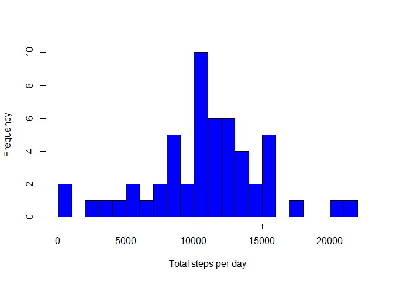
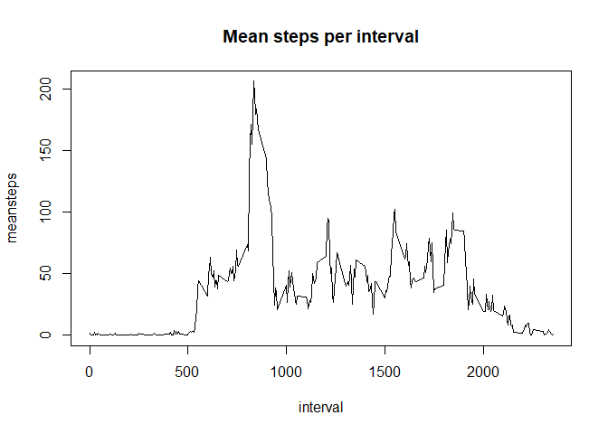
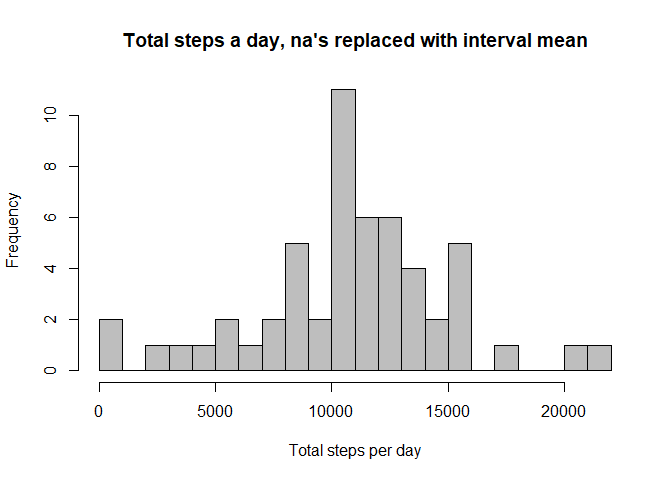
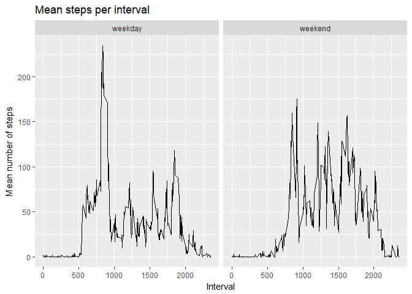

Loading and preprocessing the data
==================================

``` r
setwd("~/Coursera/5_RerpRes/Data")
library(dplyr)
library(ggplot2)

myset<- read.csv("activity.csv", colClasses = "character")
myset$steps <- as.numeric(myset$steps)
myset$date <- as.Date(myset$date, format = "%Y-%m-%d")
myset$interval <- as.numeric(myset$interval)
```

What is mean total number of steps taken per day?
=================================================

``` r
stpsday <- myset %>% group_by(date) %>% summarise(totalsteps = sum(steps), na.rm = TRUE)
hist(stpsday$totalsteps, main = "", col = "blue", xlab = "Total steps per day", breaks = 20)
```



-   The mean steps per day is: 1.07661910^{4}
-   The median steps per day is: 1.076510^{4}

What is the average daily activity pattern?
===========================================

``` r
stpsint <- myset %>% group_by(interval) %>% summarise(meansteps = mean(steps, na.rm = TRUE))
plot(stpsint, type = "l", main = "Mean steps per interval")
```



-   The interval with the highest mean is: 835.
-   The total number of rows is: 17568. The number of rows with missing values is: 2304.

Imputing missing values
=======================

``` r
myset2 <- myset
for (i in 1:nrow(myset2)){
    if (is.na(myset2$steps[i])){ 
      myset2$steps[i] <- stpsint$meansteps[i]}
}

stpsday2 <- myset2 %>% group_by(date) %>% summarise(totalsteps = sum(steps))
hist(stpsday2$totalsteps, main = "Total steps a day, na's replaced with interval mean", 
     col = "gray", xlab = "Total steps per day", breaks = 20)
```



-   The mean steps per day is: 1.076618910^{4}
-   The median steps per day is: 1.076559410^{4}

Are there differences in activity patterns between weekdays and weekends?
=========================================================================

``` r
##myset$test <- weekdays(myset$date, abbreviate = T)
myset$date <- as.character(myset$date)
myset$date <- strptime(myset$date, format = "%Y-%m-%d")
wknd <- c("za", "zo")
myset$weekday <- as.factor(with(myset, ifelse(weekdays(date, abbreviate = T) %in% wknd, TRUE, FALSE)))
levels(myset$weekday) <- c("weekday", "weekend")
mysub <- myset[,!names(myset) == 'date']
```

``` r
mysetwk <- mysub %>% group_by(weekday, interval) %>% summarise(meansteps = mean(steps, na.rm = TRUE))
qplot(interval, meansteps, data = mysetwk, facets = .~weekday, geom = c("line"),
      main = "Mean steps per interval", ylab = "Mean number of steps", xlab = "Interval")
```


